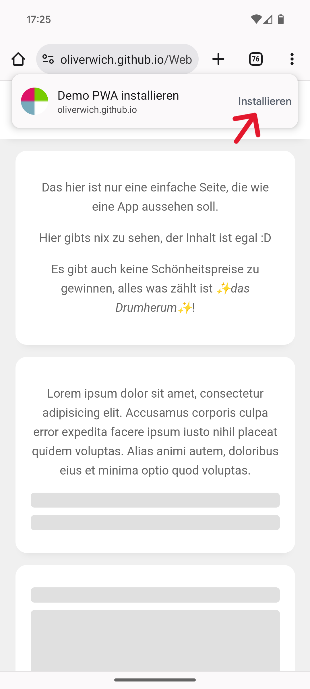
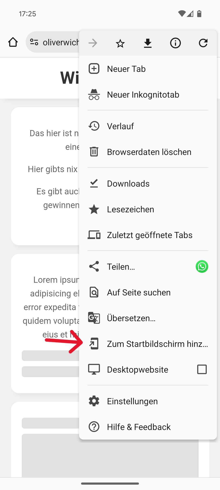
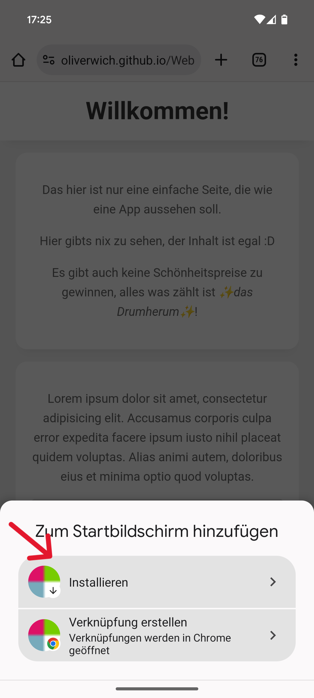

# Aufgabe 2

In dieser Aufgabe erstellt ihr ein Webmanifest welches eure Website für den Browser als App kennzeichnet.
Noch sind wir aber noch nicht bei einer PWA, sondern erst bei einer Web-App.

## Aufgabenstellung

1. Kopiert den Inhalt des Ordners `Aufgabe_2` in den Ordner `docs`.
2. Benennt die Datei `manifest.json5` in `manifest.json` um und entfernt die Kommentare.
3. Befüllt die Placeholder im Manifest mit euren Daten
4. Registriert das Manifest in eurer `index.html` Datei als Link mit dem `rel`-Attribut `manifest`
5. Pusht das Ganze
6. Installiert die Anwendung auf eurem Smartphone

> Bonus: Manifest generieren lassen mit ggf. eigenem Icon
> 
> Nutzt ein Tool wie https://progressier.com/pwa-manifest-generator, um euch das Manifest generieren zu lassen.
> Dadurch könnt ihr auch ein eigenes Icon wählen, welches automatisch passend formatiert wird.

> Bonus 2: Rich Install UI (Setzt Chrome Android voraus)
> 
> Fügt ihr mindestens einen Screenshot der App hinzu und registriert diesen im Manifest.
> Setzt dabei `form_factor` auf "narrow" für einen Screenshot im Portrait-Modus und auf "wide" für einen Screenshot im Landscape-Modus.
> Weitere Details und eine genaue Anleitung findet ihr unter https://web.dev/patterns/web-apps/richer-install-ui?hl=de

### Installations Walkthrough (Chrome Android)

#### Entweder direkt über den Banner:

#### Oder über das "Drei-Punkte-Menu":

Und dann auf "Installieren":

## Ziel

Nach dieser Aufgabe habt ihr eine Web-App, die sich auf eurem Smartphone installieren lässt und sich wie eine native App verhält.
